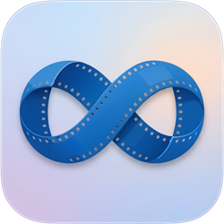

  

# SpinCycle

A native macOS Apple Silicon app for batch transcoding of video files to well known live video formats. It features a unique feature to create seamless looping versions for those times you just need a loop from a standard A->B clip (we've all been there). Designed by someone who works in live events and just wanted to make life easier than jumping into an NLE and doing this all manually and often to many clips.

## Codecs currently supported
- h264 mp4
- h265 mp4
- ProRes LT/422/4444
- HAP
- HAP Alpha
- HAP Q
- DXV
- DXV Alpha

## Features

- Drag-and-drop interface for single or batch video files
- Configurable settings: trim start, cut percentage, crossfade duration, CRF quality
- **Match Source** toggle — re-encodes using the same codec as the input file
- Multiple output codecs: H.264, HEVC, ProRes (LT / 422 / 4444), HAP (+ Alpha, Q), DXV
- Automatic fallback to H.264 if the chosen codec fails
- Output alongside source files by default, or pick a custom output folder
- Per-file progress bar during encoding

## How looping works

1. **Trim** — Removes the first N seconds of the input (default 4s) to cut encoding noise
2. **Split** — Calculates a cut point at N% of the remaining duration (default 5%) and splits the video into Part A (start→cut) and Part B (cut→end)
3. **Reassemble** — Joins as B+A with a crossfade at the seam (default 1s) using FFmpeg's `xfade` filter
4. **Encode** — Outputs using the selected codec with configurable quality

The result is a video that loops seamlessly — the end fades into the beginning.

## Requirements

- Apple Silicon CPU
- macOS 14.0 (Sonoma) or later
